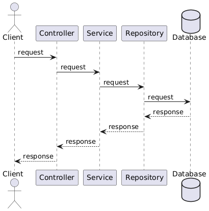
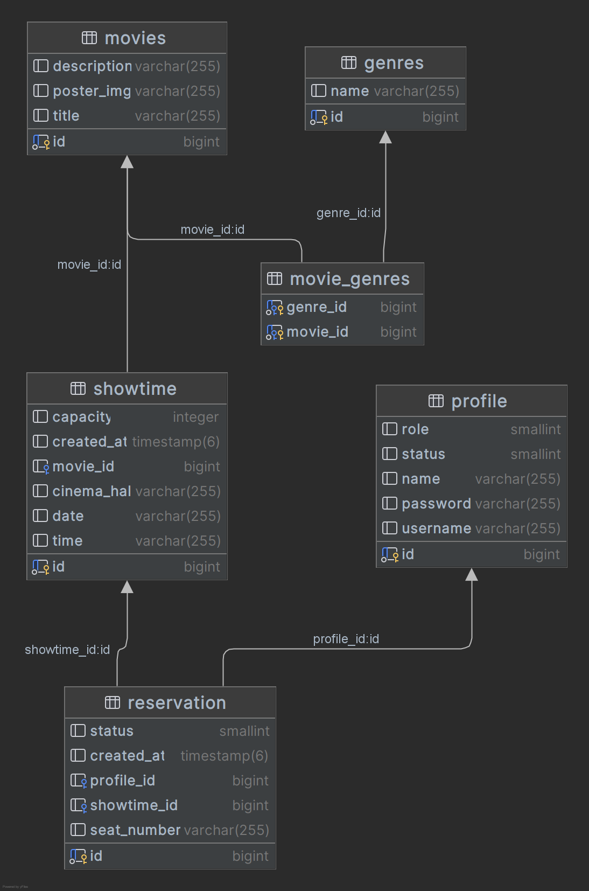

# Movie Reservation System API

This is the Movie Reservation System API that allows users to book movie tickets. It provides endpoints for managing
movies, profiles, reservations, and showtime.

## Technologies Used
- Java 17
- Spring Boot
- PostgreSQL
- Spring Data JPA
- Spring Security
- JSON Web Tokens (JWT)
- Jakarta Validation API
- Swagger API Documentation

## Sequence diagram


## Class diagram


### Relationships
- **movies** to **movie_genres**: Many-to-many relationship (one movie can have multiple genres, and one genre can be associated with multiple movies).
- **movies** to **showtime**: One-to-many relationship (one movie can have multiple showtimes).
- **profile** to **reservation**: One-to-many relationship (one profile can have multiple reservations).
- **showtime** to **reservation**: One-to-many relationship (one showtime can have multiple reservations).

## Usage
- **Registration**: Users can create an account by filling out the registration form.
- **Login**: Users can log in using their credentials.
- **View Movies**: Users can browse the list of available movies and showtimes.
- **Book Tickets**: Users can select a movie, choose a showtime, and book tickets for the chosen seats.
- **Manage Bookings**: Users can view and cancel their bookings.

## API Documentation

### Auth Controller
- **POST** `/api/v1/registration`: Register a new user.
- **POST** `/api/v1/authorization`: Authorize a user.

### Profile Controller
- **GET** `/api/v1/profile/{id}`: Retrieve a user profile by ID.
- **PUT** `/api/v1/profile/{id}`: Update a user profile.
- **GET** `/api/v1/profile`: Retrieve all user profiles (Admin Only).

### Movie Controller
- **GET** `/api/v1/movie/{id}`: Retrieve a movie by ID.
- **PUT** `/api/v1/movie/{id}`: Update a movie (Admin Only).
- **DELETE** `/api/v1/movie/{id}`: Delete a movie by ID (Admin Only).
- **GET** `/api/v1/movie`: Retrieve all movies.
- **POST** `/api/v1/movie`: Create a new movie (Admin Only).

### Reservation Controller
- **GET** `/api/v1/reservation`: Retrieve all reservations.
- **POST** `/api/v1/reservation`: Create a new reservation.
- **GET** `/api/v1/reservation/{id}`: Retrieve a reservation by ID.
- **DELETE** `/api/v1/reservation/{id}`: Delete a reservation by ID.

### Showtime Controller
- **GET** `/api/v1/showtime`: Retrieve all showtimes.
- **POST** `/api/v1/showtime`: Create a new showtime (Admin Only).
- **DELETE** `/api/v1/showtime/{id}`: Delete a showtime by ID (Admin Only).
- **GET** `/api/v1/showtime/{id}`: Retrieve a showtime by ID.

# Security
- The API is secured using JSON Web Tokens (JWT) handled by Auth0. To access the API, you will need to obtain a JWT by authenticating with the /login endpoint. The JWT should then be passed in the Authorize option available in the Swagger-ui.


## How to Run

1. Make sure you have **Java** and **Maven** installed.
2. Clone the repository:
   ```bash
   git clone https://github.com/your-username/movie_reservation_system.git
3. Navigate to the project directory:

   ```bash
   cd movie_reservation_system

4. Build the project using Maven:
   ```bash
   mvn clean install

5. Run the application:
   ```bash
   mvn spring-boot:run

Notes
All operations on movies, showtimes, and profiles that modify data (POST, PUT, DELETE) are restricted to admins only.
Authentication is required to access the API endpoints. Use the /api/v1/authorization endpoint to obtain a token.

